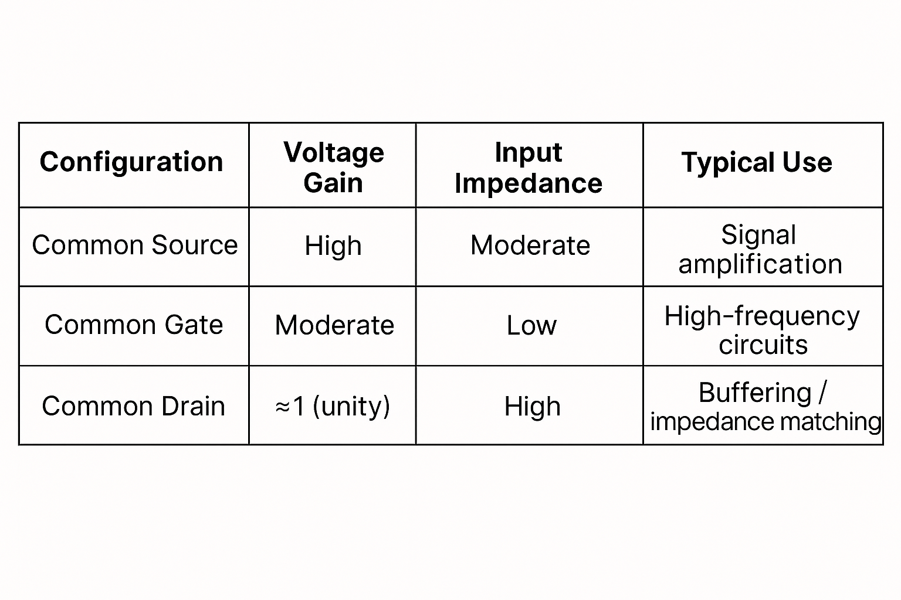

**Analysis of CS Amplifier using 180 nm technology file in LTspice simulator**
---
A **MOSFET** (Metal-Oxide-Semiconductor Field-Effect Transistor) is an electronic component that controls the flow of current using voltage. It can work as a **switch** when working in cut-off and triode regions and as an **amplifier** when biased in saturation region.

There are three different amplifier configurations of MOSFET:
1. Common Gate (CG) Amplifier
2. Common Drain (CD) Amplifier
3. Common Source (CS) Amplifier

Out of the three MOSFET amplifier configurations, the Common Source (CS) amplifier is considered the best for amplification.
- High Voltage Gain: It can take a weak input signal and produce a much stronger output.
- Good Input Impedance: It doesn’t load down the previous stage too much, so signals can enter easily.
- Moderate Output Impedance: It can drive the next stage effectively without too much loss.

**Comparision Table:**

