**Analysis of CS Amplifier using 180 nm technology file in LTspice simulator**
---
A **MOSFET** (Metal-Oxide-Semiconductor Field-Effect Transistor) is an electronic component that controls the flow of current using voltage. It can work as a **switch** when working in cut-off and triode regions and as an **amplifier** when biased in saturation region.

There are three different amplifier configurations of MOSFET:
1. Common Gate (CG) Amplifier
2. Common Drain (CD) Amplifier
3. Common Source (CS) Amplifier

Out of the three MOSFET amplifier configurations, the Common Source (CS) amplifier is considered the best for amplification.
- High Voltage Gain: It can take a weak input signal and produce a much stronger output.
- Good Input Impedance: It doesn’t load down the previous stage too much, so signals can enter easily.
- Moderate Output Impedance: It can drive the next stage effectively without too much loss.

**Comparision Table:**

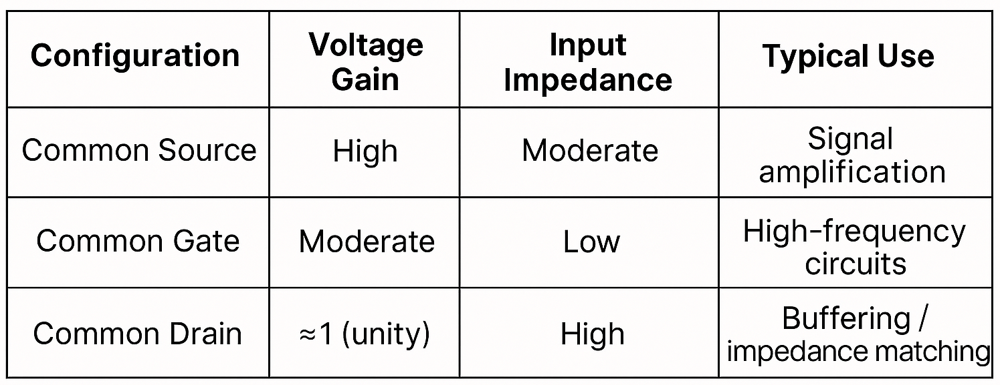

---

**Common Source (CS) MOSFET amplifier with a resistive load:**

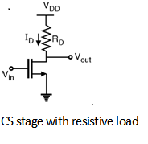

- **Input**: Applied at the gate terminal.
- **Output**: Taken from the drain terminal.
- **Source**: Connected to ground (common point).
- **Load**: A resistor is connected at the drain (called the drain resistor, ).

The amplifier takes a small input signal at the gate and delivers a high voltage gain, high input impedance, and produces an inverted output (180° phase shift) at the drain through the resistive load.

With coupling capacitor:

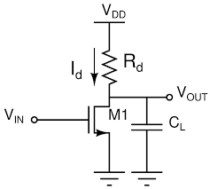

The capacitor at the output of a CS amplifier filters out DC and passes the amplified AC signal, making the amplifier practical for real-world use.

From the output characteristics, we know that the amplifier operates in the saturation region of the MOSFET, which is essential for proper amplification. The resistor at the drain converts current into voltage, enabling amplification in the saturation region. 

MOSFET is in OFF state or cutoff region when Vgs < Vth. Hence Vout = Vdd. But when Vgs >= Vth and Vds >= (Vgs-Vth), MOSFET operates in saturation region, acting as an amplifier. In this region, drain current Id flows through resistor Rd and produces a voltage drop VRd = (Id*Rd) across it. This reduces the output voltage at the drain.

When the input voltage at the gate increases, the MOSFET allows more drain current to flow. This larger drain current causes a greater voltage drop across the drain resistor (Rd). As a result, the output voltage at the drain decreases causing the output to be 180 degrees out of phase. Thus CS amplifier is called as an inverting amplifier.

Below is the Voltage Transfer characteristics of CS amplifier:

The VTC of a CS amplifier shows an inverted relationship between input and output — as input voltage increases, output voltage decreases, with the most useful amplification occurring in the saturation region.

**Frequency response of CS amplifier:**

Without coupling capacitor:

With coupling capacitor:

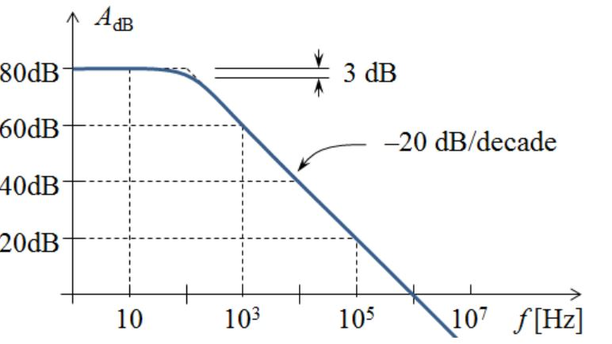

The output capacitor acts like a high-pass filter — it blocks DC, attenuates low-frequency signals, and allows mid-to-high frequency signals to pass with amplification.

---

Q1) Design a CS amplifier using NMOSFET in tsmc180nmtech.lib in LTSPICE.

Given: Vdd = 1.8V, Power <= 1mW, CL = 1pF, L = 180nm, Vin = 10mV, f = 1kHz

**CIRCUIT DIAGRAM:**

Without Capacitor:

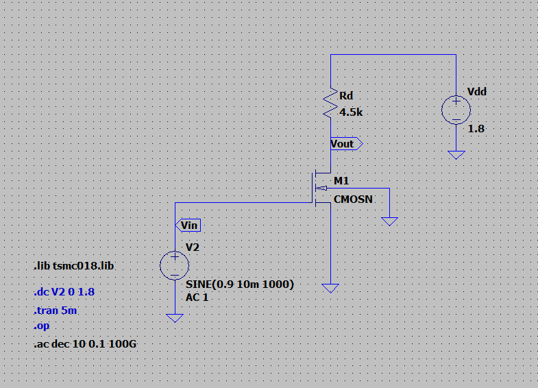

With Capacitor:

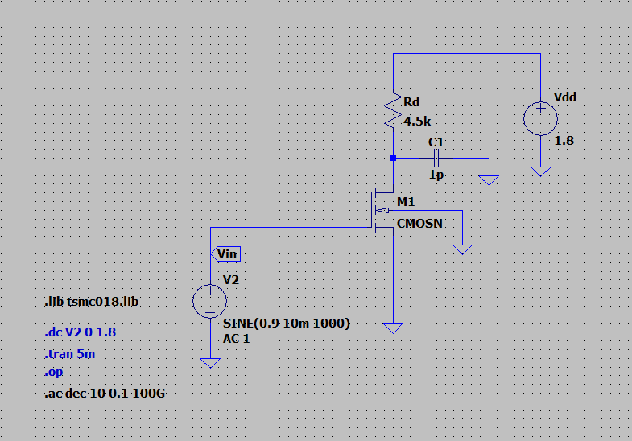

**DESIGN CALCULATIONS:**

Power = Voltage * Current

P = Vdd*Id

Id = P/Vdd = 1m/1.8 = 555.56uA

Thus, for Power <= 1mW, Current Id <= 555.56uA

Therefore we choose Id = 200uA

Vd = Vout = 50% Vdd = 50%*(1.8) = 0.9V

To choose the value of Rd, 

Vout = Vdd - (Id*Rd)

0.9 = 1.8 - (200u*Rd)

Rd = 4.5kohm

From the datasheet, Vth = 0.366V

For MOSFET to work in saturation region Vgs >= Vth, therefore consider a value for Vgs which is greater than the threshold value.

let Vgs = 0.9V (> Vth)

Also Vgs - Vt = Vov = 0.9-0.366 = 0.534V. Thus by fundamental concept , Vds >= Vov , here 1.12V > 0.534V . Its in SATURATION.

From the drain current formula in saturation region, we get the value of W.

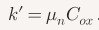 = 230.4uA/V^2

Hence, W = 1090nm 

**1. DC Operating Point:**

To fix the DC operating point, 

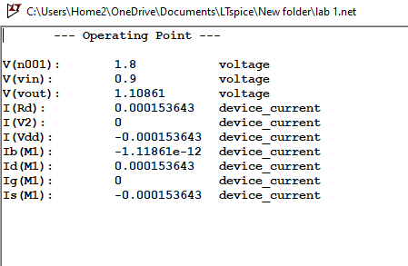

Here, Id = 153uA. For Id to be 200uA, we alter the value of W

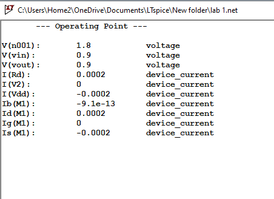

With having L = 180nm and W = 1530.65nm, the drain current Id = 200uA is calculated and verified.

**Calculated: W = 1090nm ; Id = 153uA**

**Simulated: W = 1530.65nm ; Id = 200uA**

The DC biasing ensures that the drain current is set according to the power budget while keeping the MOSFET operating in the saturation region, which is essential for achieving proper and stable amplification.

**2. Voltage Transfer Characteristics (Vin vs Vout):**

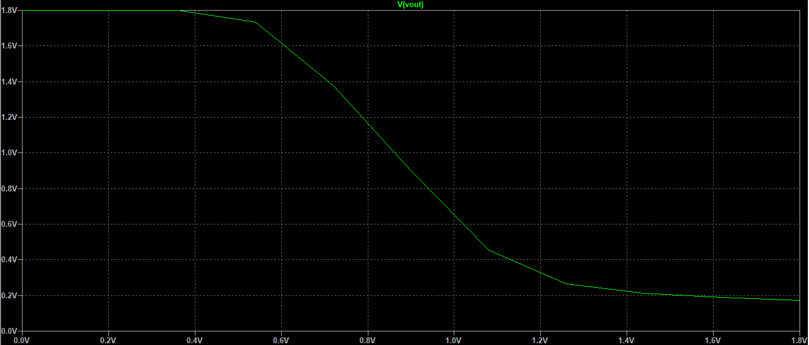

The VTC demonstrates the inverted relationship between input and output.

**3. Transient Analysis:**

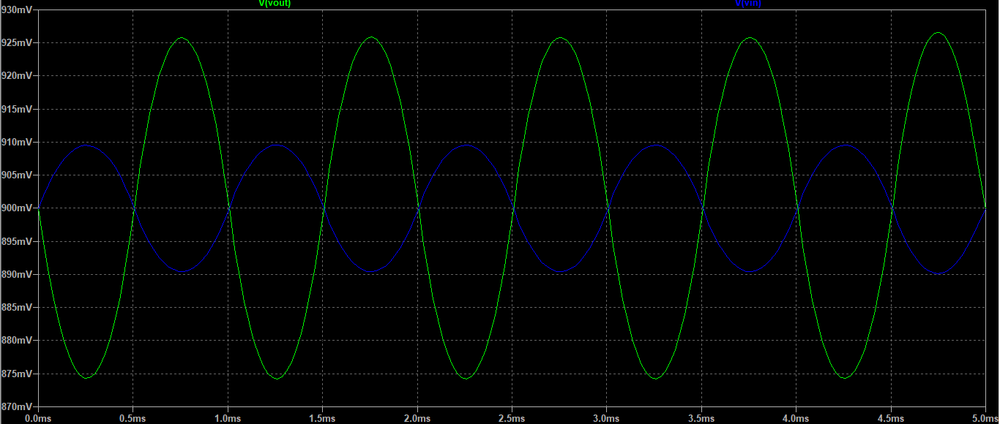

Here the blue waveform represents the input voltage and the green waveform represents the output voltage. We can observe the 180 degree phase shift and the amplification of the output signal.

Peak to peak values of Vin = 19.28mV ; Vout = 51.64mV

Therefore, the Practical Gain |Av| = Vout/Vin = 2.678 = 8.55dB

From the theoretical calculations, Transconductance gm = 2Id/Vov = 0.749mmho

|Av| = gm*Rd = 3.37 = 10.55dB

Hence,

**Theoretical |Av| = 10.55dB**

**Practical or simulated |Av| = 8.55dB**

In theory, the MOSFET has infinite output resistance, no parasitic capacitances, and perfect biasing, which leads to higher calculated gain. In simulation, effects such as channel‑length modulation, finite output resistance, parasitic capacitances, and small bias shifts reduce the effective gain. Thus, the simulated gain is lower and more realistic, while the theoretical gain represents the ideal upper limit.

**4. Frequency Analysis :**

- Without Capacitor

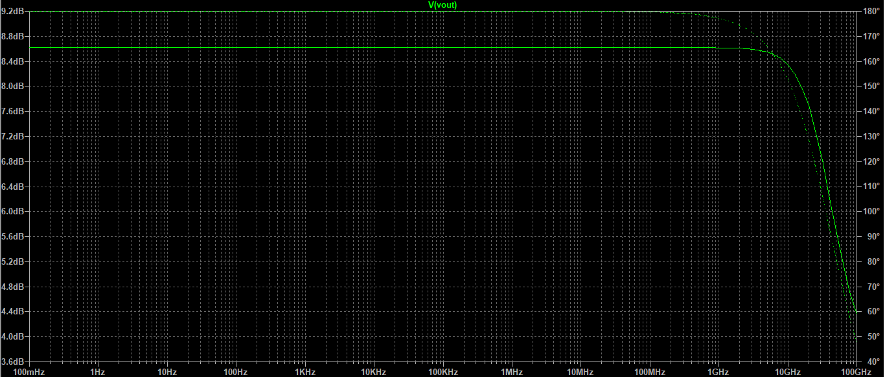

Bandwidth Bw = 51.892GHz

Gain Bandwidth Product GBwP = Av*Bw = 140.004GHz

- With Capacitor

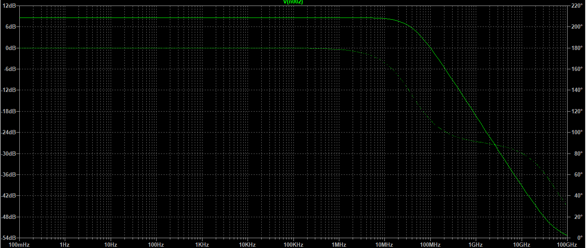

Bandwidth Bw = 40.52MHz

GBwP = Av*Bw = 108.59MHz

Therefore, GBwP:

**Without Capacitor = 140.004GHz**

**With Capacitor = 108.59MHz**

The presence of the coupling capacitor shifts the frequency response upward, limiting low‑frequency operation and reducing the effective bandwidth. Without the capacitor, the amplifier shows a much wider bandwidth (in the GHz range), but with the capacitor, the usable bandwidth is restricted to the mid‑frequency range (in the MHz range).

Hence a CS Amplifier of Vgs = 0.9V, W = 1530.65nm , L = 180nm , Vdd = 1.8V and Rd = 4.5k is designed and verified for power budget of P = 1uW.
