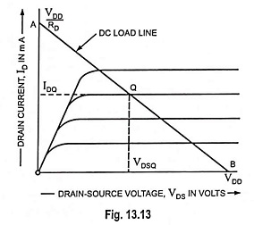
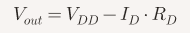
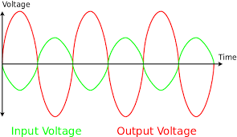
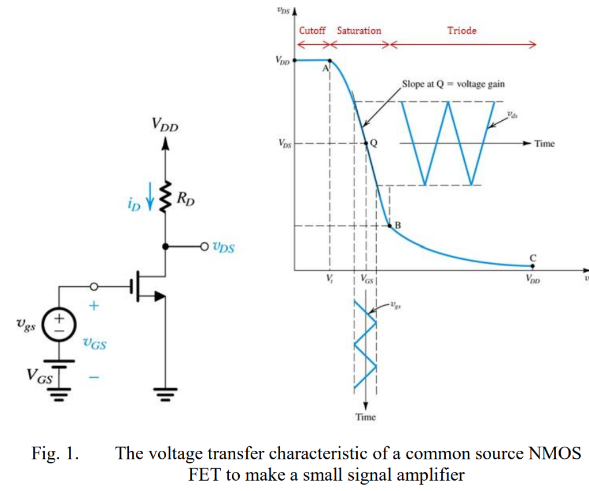
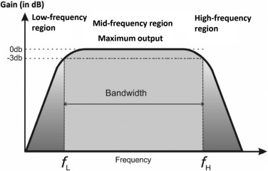

**Analysis of CS Amplifier using 180 nm technology file in LTspice simulator**
---
A **MOSFET** (Metal-Oxide-Semiconductor Field-Effect Transistor) is an electronic component that controls the flow of current using voltage. It can work as a **switch** when working in cut-off and triode regions and as an **amplifier** when biased in saturation region.

There are three different amplifier configurations of MOSFET:
1. Common Gate (CG) Amplifier
2. Common Drain (CD) Amplifier
3. Common Source (CS) Amplifier

Out of the three MOSFET amplifier configurations, the Common Source (CS) amplifier is considered the best for amplification.
- High Voltage Gain: It can take a weak input signal and produce a much stronger output.
- Good Input Impedance: It doesn’t load down the previous stage too much, so signals can enter easily.
- Moderate Output Impedance: It can drive the next stage effectively without too much loss.

**Comparision Table:**

---

**Common Source (CS) MOSFET amplifier with a resistive load:**

- **Input**: Applied at the gate terminal.
- **Output**: Taken from the drain terminal.
- **Source**: Connected to ground (common point).
- **Load**: A resistor is connected at the drain (called the drain resistor, ).

The amplifier takes a small input signal at the gate and delivers a high voltage gain, high input impedance, and produces an inverted output (180° phase shift) at the drain through the resistive load.

With coupling capacitor:

The capacitor at the output of a CS amplifier filters out DC and passes the amplified AC signal, making the amplifier practical for real-world use.

From the output characteristics, we know that the amplifier operates in the saturation region of the MOSFET, which is essential for proper amplification. The resistor at the drain converts current into voltage, enabling amplification in the saturation region. 

MOSFET is in OFF state or cutoff region when Vgs < Vth. Hence Vout = Vdd. But when Vgs > Vth and Vds >= (Vgs-Vth), MOSFET operates in saturation region, acting as an amplifier. In this region, drain current Id flows through resistor Rd and produces a voltage drop VRd = (Id*Rd) across it. This reduces the output voltage at the drain.

When the input voltage at the gate increases, the MOSFET allows more drain current to flow. This larger drain current causes a greater voltage drop across the drain resistor (Rd). As a result, the output voltage at the drain decreases causing the output to be 180 degrees out of phase. Thus CS amplifier is called as an inverting amplifier.

Below is the Voltage Transfer characteristics of CS amplifier:

The VTC of a CS amplifier shows an inverted relationship between input and output — as input voltage increases, output voltage decreases, with the most useful amplification occurring in the saturation region.

Frequency response of CS amplifier:

Without coupling capacitor:

With coupling capacitor:

The output capacitor acts like a high-pass filter — it blocks DC, attenuates low-frequency signals, and allows mid-to-high frequency signals to pass with amplification.

---

The GBWP is not fundamentally changed, but the usable bandwidth is shifted upward, cutting off low-frequency response.
The coupling capacitor doesn’t increase GBWP; instead, it limits low-frequency gain, effectively narrowing the amplifier’s bandwidth at the bottom end. The GBWP of the MOSFET itself stays the same, but the frequency response curve shifts, so the amplifier is optimized for mid-to-high frequency signals.

