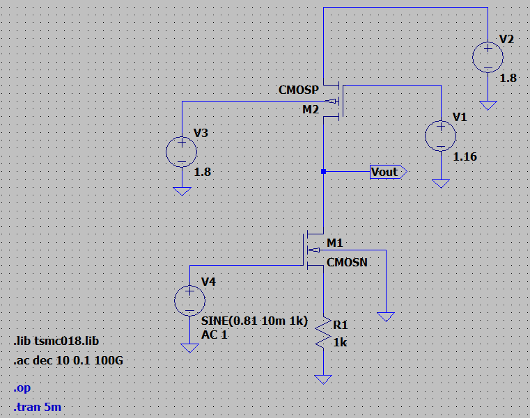
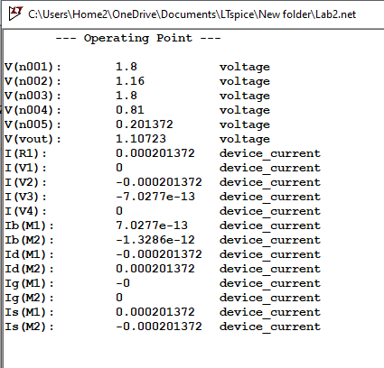
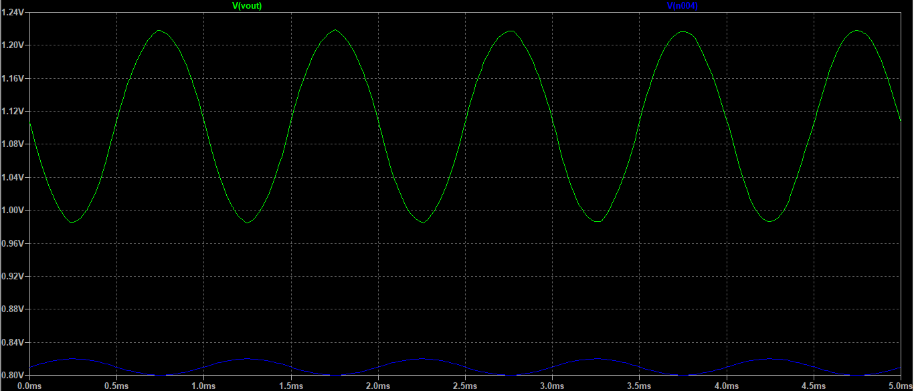
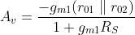
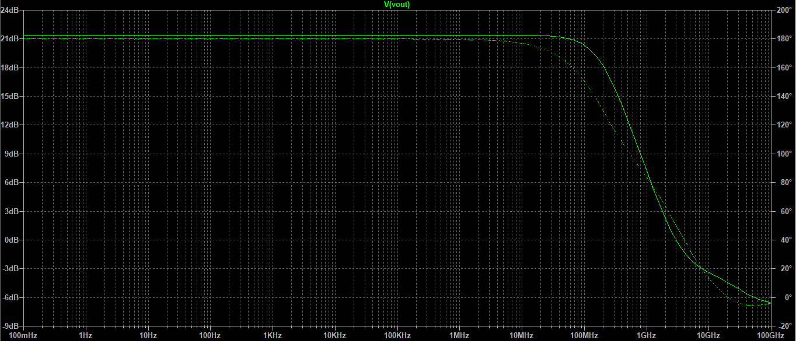
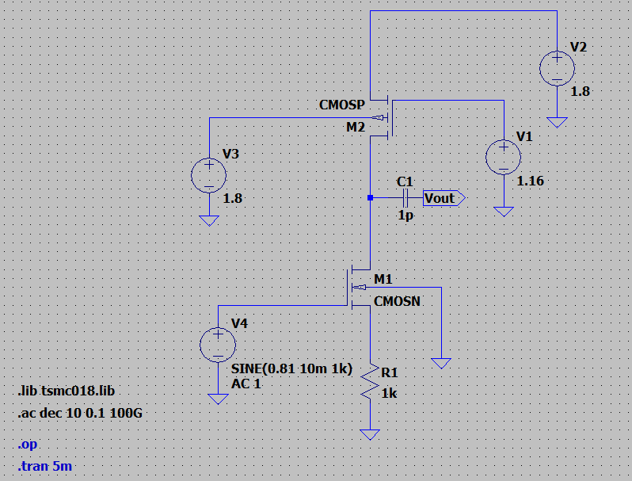
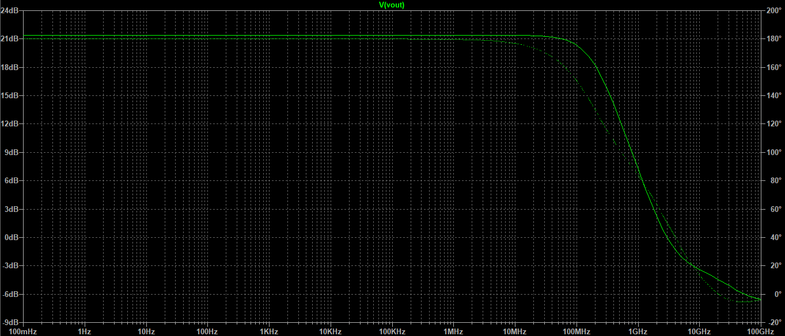
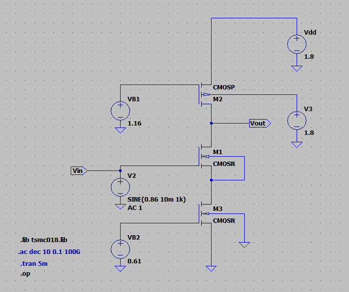

Q1) Design CS amplifier with PMOS active load configuration in tsmc180nmtech.lib in LTSPICE.

Given: VDD = 1.8V, Power <= 1mW, CL = 1pF, L = 180nm, Vin = 10mV, f = 1kHz

**CIRCUIT DIAGRAM:**

Without Capacitor:

**DESIGN CALCULATIONS:**

**1. DC ANALYSIS:**

Power = Voltage * Current

P = VDD*ID

Let ID = 200uA

Thus, Power = 1.8*200u = 0.36mW which is <= 1mW 

Given, The drop across RS is 0.2V --> VS = 0.2V

Vout = VDS + IDRS = (VDD/2) + 0.2 = (1.8/2) + 0.2 = 1.1V

We know that, by Ohm's law,

VS = IDRS

RS = VD/ID = 0.2/200u = 1kohm
   
For M1 (NMOS) transistor:

Given, the overdrive voltage VOV = 0.25V

From the datasheet, VTH = 0.36V

We know that,

VOV = VGS - VTH  

VGS = VOV + VTH = 0.25 + 0.36 = 0.61V

Biasing voltage VB1 is obtained by,

VB1 = VG1 = VGS + IDRS = 0.61 + 0.2 = 0.81V
  
For M1 to be SATURATION,

VGS >= VTH

0.61 >= 0.36

and VDS >= VOV

(VDD/2) >= VOV

0.9 >= 0.25

Hence both the conditions are satisfied. Therefore M1 is operating in **SATURATION** region.
                                                                          
From the drain current formula in saturation region, we get the value of W.

 = 230.4uA/V^2

Hence, W1 = 5um 

---

For M2 (PMOS) transistor:

Given, the overdrive voltage VOV = 0.25V

From the datasheet, VTH = 0.39V

We know that,

VOV = VSG - |VTH|  

VSG = VOV + |VTH| = 0.25 + 0.39 = 0.64V

Biasing voltage VB1 is obtained by,

VB2 = VG2 = VS + VSG = VDD - VSG = 1.8 - 0.64 = 1.16V
  
For M2 to be SATURATION,

VSG >= VTH

0.64 >= 0.39

and VDS >= VOV

(VDD/2) >= VOV

0.9 >= 0.25

Hence both the conditions are satisfied. Therefore M2 is operating in **SATURATION** region.
  
From the drain current formula in saturation region, we get the value of W.

 = 230.4uA/V^2

Hence, W2 = 11.823um 
   
To fix the DC operating point, 

Initially, we get 

**ID = 75.029uA for W1 = 5um and W2 = 11.823um**

After altering W values, we get 

**ID = 201.37uA for W1 = 27um and W2 = 36.5um**

The DC biasing ensures that the drain current is set according to the power budget while keeping the MOSFET operating in the saturation region, which is essential for achieving proper and stable amplification.

---

**2. TRANSIENT ANALYSIS:**

Here the blue waveform represents the input voltage and the green waveform represents the output voltage. We can observe the 180 degree phase shift and the amplification of the output signal.

Peak to peak value of **Vin(p-p) = 20mV** 

Vout (max) = 1217 mV = 1.217 V

Vout (min) = 986 mV = 0.986 V

Thus, **Vout (p-p) = 231mV**

and since the Vout(DC) = 1.1V

This indicates that the amplifier is biased above mid-supply (0.9V), resulting in limited symmetrical swing.

From the transient analysis, the output remains within saturation limits and does not show distortion, confirming stable operation within allowable swing range.

---

**3. AC ANALYSIS:**

From the theoretical calculations, Transconductance gm1 = 2id/vov = (2*200u)/0.25 = 1.6mmho

lamda = 0.1 V^-1

r01 = 1/(lamda*id) = 1/(0.1 * 200u) = 50kohm

Similarly, r02 = 50kohm
  

Thus,

 = -15.384 V/V

|Av| = 15.384 V/V = 23.741 dB
  

- Without Capacitor

Av = 21.39 dB 

Bandwidth Bw = 189.823 MHz

Gain Bandwidth Product GBwP = Av*Bw = 2227.659 MHz
  
- With Capacitor

Av = 21.39 dB

Bandwidth Bw = 190.2 MHz

GBwP = Av*Bw = 2232.083 MHz

Therefore, GBwP:

**Without Capacitor = 2227.659 MHz**

**With Capacitor = 2232.083 MHz**

---

**RESULTS:**

From the LTspice simulation of the common-source (CS) amplifier:
- DC Operating Point: The biasing ensured that the MOSFETs operate in the saturation region, which is essential for linear amplification and stable gain.

- Transient Response: The input waveform (Vin) of ~20 mVpp produced an output waveform (Vout) of ~231 mVpp with a significantly larger amplitude and a 180° phase shift, confirming that the stage is functioning as a CS amplifier.

- Small-Signal AC Gain: The voltage gain |Av| from AC analysis was observed to be approximately 15.384 V/V (≈ 23.741 dB).

    - Frequency Response:
 
         Without coupling capacitor: Av ≈ 21.39 dB, Bandwidth (BW) ~189.8 MHz

         With coupling capacitor: Av ≈ 21.39 dB, BW ~190.2 MHz
  
    - Gain-Bandwidth Product (GBW):

         Without capacitor: ~2227.66 MHz

         With capacitor: ~2232.08 MHz

These results indicate consistent performance with high gain and wide bandwidth, with negligible effect from adding the coupling capacitor.
  
**VALIDATION**

- The transistor operates in the saturation region, ensuring proper amplification.

- The DC drain voltage (~1.1 V) confirms that the MOSFET is properly biased and not in cutoff or triode region.

- Since , the output remains safely within supply voltage range (0 V to 1.8 V), confirming stable operation.

- The amplified and phase-inverted output waveform matches the theoretical behavior of a CS amplifier.

- The coupling capacitor value (1 pF), together with the circuit resistance, results in a cutoff frequency lower than the operating frequency range. Therefore, the capacitor does not significantly affect the gain or bandwidth in the observed region.

Thus, the simulation results are consistent with theoretical expectations.
  
**INFERENCE**

- The CS amplifier configured with TSMC 180 nm technology satisfies the design goals of biasing, gain, and bandwidth under the power constraint (≤ 1 mW). The stage exhibits expectations of a CS amplifier — high voltage gain, 180° phase inversion, and broad frequency response.

- The output swing of 231 mV (peak-to-peak) indicates proper small-signal amplification. The DC bias level (~1.10 V) is slightly above mid-supply (0.9 V), resulting in limited symmetrical swing.

- The observed Gain-Bandwidth Product (GBW) is high, showing that the design is suitable for moderate-frequency analog amplification.

Overall, the simulation confirms that the CS amplifier is operating in the intended region and meets design criteria for gain and frequency performance.
  

---
  
Q2) Design CS amplifier with PMOS active load and NMOS current source degeneration in tsmc180nmtech.lib in LTSPICE.

Given: VDD = 1.8V, Power <= 1mW, CL = 1pF, L = 180nm, Vin = 10mV, f = 1kHz

**CIRCUIT DIAGRAM:**

Without Capacitor:

**DESIGN CALCULATIONS:**

**1. DC ANALYSIS:**

Power = Voltage * Current

P = VDD*ID

Let ID = 200uA

Thus, Power = 1.8*200u = 0.36mW which is <= 1mW 

and,

Vout = VDD/2 = 1.8/2 = 0.9 V
   
For M3 (NMOS) transistor:

Given, the overdrive voltage VOV = 0.25V

From the datasheet, VTH = 0.36V

We know that,

The biasing voltage VB2 = VGS = VOV + VTH = 0.25 + 0.36 = 0.61V

  
For M3 to be SATURATION,

VGS >= VTH

0.61 >= 0.36

and VDS >= VOV  

VDS = 0.263 V from the simulation

Hence, 0.263 >= 0.25

Therefore both the conditions are satisfied. Therefore M3 is operating in **SATURATION** region.

  
For M1 (NMOS) transistor :

VOV = 0.25V and VTH = 0.36V

Also, the source of M1 = drain of M3

