__DIFFERENTIAL AMPLIFIER__
---
A Differential Amplifier is an electronic circuit that __amplifies the difference between two input signals while rejecting any signal common to both inputs__. It is widely used in analog circuits such as operational amplifiers because of its high noise immunity and precision. The basic circuit typically consists of two matched transistors sharing a common emitter/source connection, with one input applied to each transistor. When the input voltages differ, the amplifier produces an output proportional to their voltage difference. Its key characteristics include high common-mode rejection ratio (CMRR), good stability, and linear amplification, making it essential in signal conditioning and instrumentation applications.

__Differential Input Voltage: vid = vin1 - vin2__

---

__Design and analyze the MOS Differential Amplifier circuit for the following specifications__

VDD = 0.9V; 
VSS = -0.9V; 
P <= 1.5W; 
Vincm = 0V; 
Voutcm = 0V; 
Vp = -0.7V;
L = 360nm

__CIRCUIT - 1:__

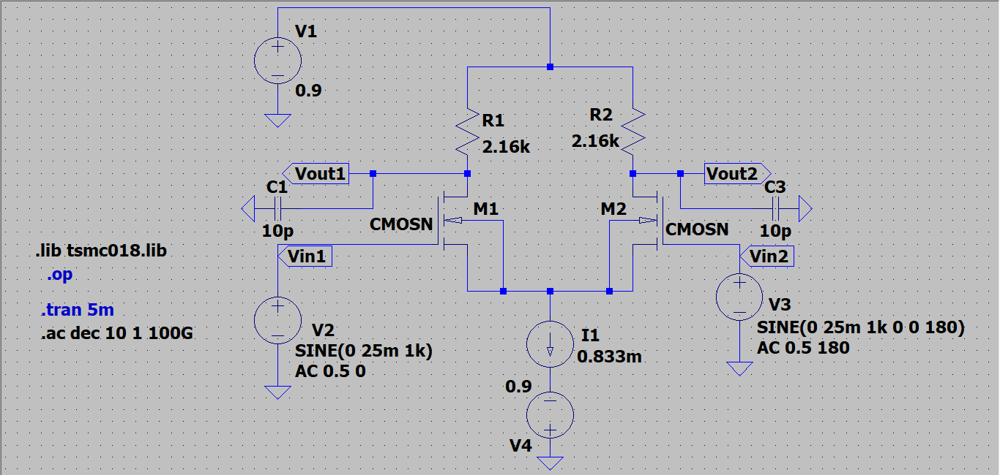

- __DC ANALYSIS:__

Power, P = 1.5mW  
P = VDD * ID  
1.5m = 1.8 * ID  
__ID = ISS = 0.833mA__

Since the 2 branches are identical, current through M1, __ID1__ = current through M2, __ID2__ = __ISS/2 = 0.4165mA__

Applying KVL,   
Vout = VDD - IDRD  
RD = (VDD - Vo)/ID  
__RD = 2.16Kohm__

For NMOS M1 and M2,  
VG1 = VG2 = Vincm = 0V  
VGS1 = VG1 - VS1 = 0 - (-0.7) = 0.7V  
VOV1 = VGS1 - VT = 0.7 - 0.36 = 0.34V  
VDS1 = VD1 - VS1 = 0 - (-0.7) = 0.7V  

Since, VGS1 >= VT  --> 0.7V > 0.36V  
and, VDS1 >= VGS1 - VT --> 0.7V >= 0.34V  
Both __M1 and M2 are in SATURATION__

Width of M1 and M2 is given by current equation ,  
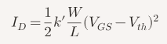  
Substituting the values of ID1, L, VOV and kn' we get, __W = 11.259&mu;m__  

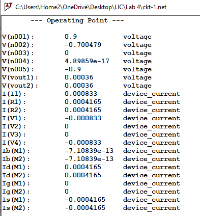  

Therefore, the DC operating point is set.

- __TRANSIENT ANALYSIS:__

Input swing,  
Vincmmin = VGS1 + VS = 0.7 + (-0.7) = 0V  
Vincmmax = Vout + VT = 0 + 0.36 = 0.36V  

Output swing,  
Voutcmmin = VDD - IDRD = -0.9V  
Voutcmmax = VDD = 0.9V  

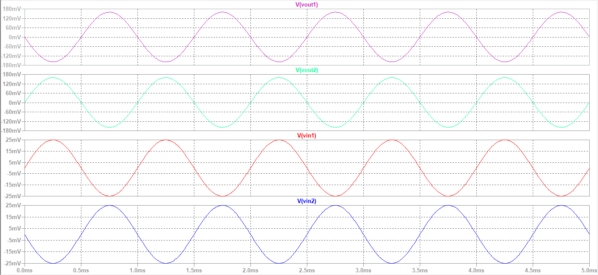

The simulated output waveforms Vout1 and Vout2 remain within the calculated output swing range, confirming that the differential amplifier operates within permissible limits without clipping or distortion. This indicates proper biasing and linear amplification of the differential input signals.  
The two outputs are equal in amplitude and opposite in phase, verifying correct differential amplifier behavior.

The differential input voltage of the amplifier varies within the range:  
__-&radic;2 VOV < vid <  &radic;2 VOV__  
-&radic;2 * 0.34 < vid <  &radic;2 * 0.34  
-0.48V < vid <  0.48V  

__CASE 1: vid <  &radic;2 VOV__  
let vidp-p = 100mV

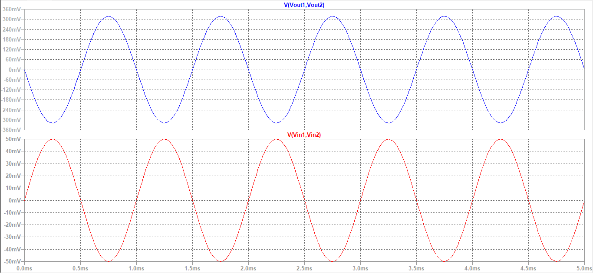

__CASE 2: vid >  &radic;2 VOV__  
let vidp-p = 1.6V

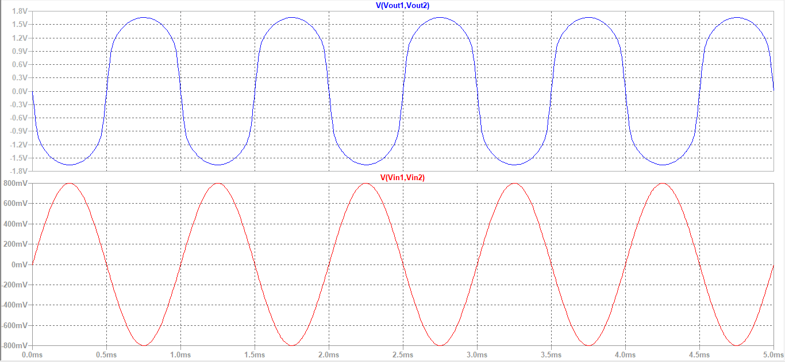

For -&radic;2 VOV < vid <  &radic;2 VOV, the differential amplifier operates linearly with undistorted output. Beyond this range, nonlinear behavior occurs (CASE 2), causing waveform distortion.

- __AC ANALYSIS:__

Transconductance, gm = (2*ID1)/VOV = 2.45 mS

The gain can be found by using __Half circuit analysis__,  
                    Gain = gm * RD  
                         = 2.45m * 2.16k  
                         = 5.292 V/V  
                         = 14.47dB  
Therefore the theoretical gain is 14.47dB

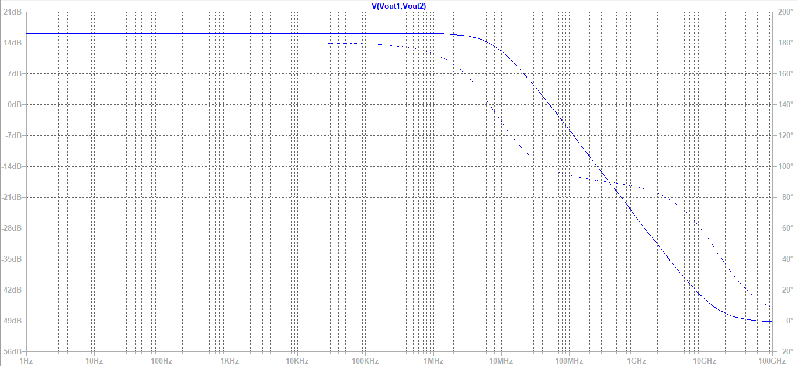

The simulated gain is 16.15dB  
Frequency at -3dB gain = 5.57GHz  
Gain Bandwidth product = 35.756GHz

__RESULTS:__

- The MOS differential amplifier was successfully designed and analyzed for the given specifications.
- Both NMOS transistors operated in saturation region under the chosen bias conditions.
- The calculated theoretical gain was 14.47 dB, while the simulated gain obtained was 16.15 dB.
- The output waveforms were equal in amplitude and 180° out of phase, confirming proper differential operation.
- Linear amplification was observed for input range -&radic;2 VOV < vid <  &radic;2 VOV, while distortion occurred beyond this range.
- The measured bandwidth was 5.57 GHz, and gain-bandwidth product was 35.759 GHz.

__INFERENCE:__

The simulation confirms that the designed differential amplifier satisfies the required operating conditions and performs as expected. The close agreement between theoretical and simulated gain validates the design calculations. The amplifier shows stable linear operation within the allowable differential input range and transitions to nonlinear behavior beyond it, matching theoretical differential amplifier characteristics.

---

__CIRCUIT - 2:__

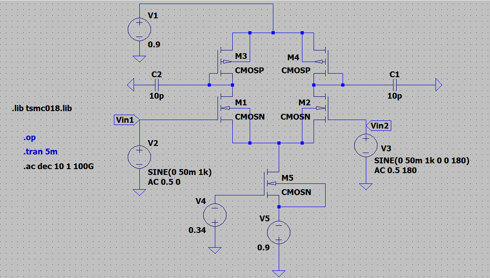

- __DC ANALYSIS:__

Power, P = 1.5mW  
P = VDD * ID  
1.5m = 1.8 * ID  
__ID = ISS = 0.833mA__

Since the 2 branches are identical, current through M1 & M3, __ID1__ = current through M2 & M4, __ID2__ = __ISS/2 = 0.4165mA__

For PMOS M3 and M4,  
VSG3 = VSG4 = VSD3 = VSD4  
VG3 = VG4 = VD3 = VD4 = Vout = 0V  

VOV3 = VSG3 - |VT| = (0.9 - 0) - 0.39 = 0.51V  
VSD3 = VS3 - VD3 = 0.9 - 0 = 0.9V  

Since, VSG3 >= VT  --> 0.9V > 0.39V  
and, VSD3 >= VOV --> 0.9V >= 0.51V  
Both __M3 and M4 are in SATURATION__

Width of M3 and M4 is given by current equation ,  
  
Substituting the values of ID1, L, VOV and kp' we get, __W = 11.832&mu;m__  

For NMOS M1 and M2,  
VG1 = VG2 = Vincm = 0V  
VGS1 = VG1 - VS1 = 0 - (-0.7) = 0.7V  
VOV1 = VGS1 - VT = 0.7 - 0.36 = 0.34V  
VDS1 = VD1 - VS1 = 0 - (-0.7) = 0.7V  

Since, VGS1 >= VT  --> 0.7V > 0.36V  
and, VDS1 >= VGS1 - VT --> 0.7V >= 0.34V  
Both __M1 and M2 are in SATURATION__

Width of M1 and M2 is given by current equation ,  
  
Substituting the values of ID1, L, VOV and kn' we get, __W = 11.259&mu;m__  

For NMOS M5,  
VD5 = VS1 = -0.7V  
VDS5 = VD5 - VS5 = (-0.7) - (-0.9) = 0.2V  

For M5 to be in Saturation,  
VDS5 >= VGS5 - VT  
VGS5 <= VDS5 + VT  
VG5 - (-0.9) = 0.2 + 0.36  
VG5 = -0.34V  

Width of M5 is given by current equation ,  
  
Substituting the values of ID, L, VOV and kn' we get, __W = 65.078&mu;m__ 

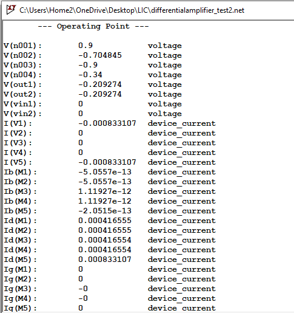  

Therefore, the DC operating point is set.

- __TRANSIENT ANALYSIS:__

Input swing,  
Vincmmin = VGS1 + VS1 = 0.7 - 0.7  = 0V  
Vincmmax = Vout + VT = 0 + 0.36 = 0.36V  

Output swing,  
Voutcmmin = VS1 + VOV1 = -0.7 + 0.34 = -0.36V   
Voutcmmax = VDD - VOV1 = 0.9 - 0.51 = 0.39V  

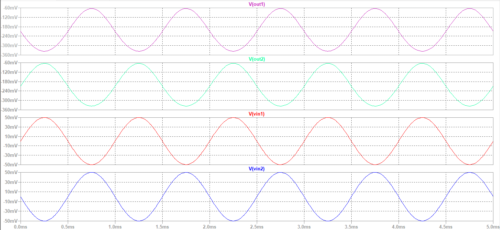

The simulated output waveforms remain within the limits, confirming that both NMOS and PMOS transistors operate in saturation and the amplifier maintains proper linear operation without distortion.

The differential input voltage of the amplifier varies within the range:  
__-&radic;2 VOV < vid <  &radic;2 VOV__   
-&radic;2 * 0.34 < vid <  &radic;2 * 0.34  
-0.48V < vid <  0.48V  

__CASE 1: vid <  &radic;2 VOV__  
let vidp-p = 100mV

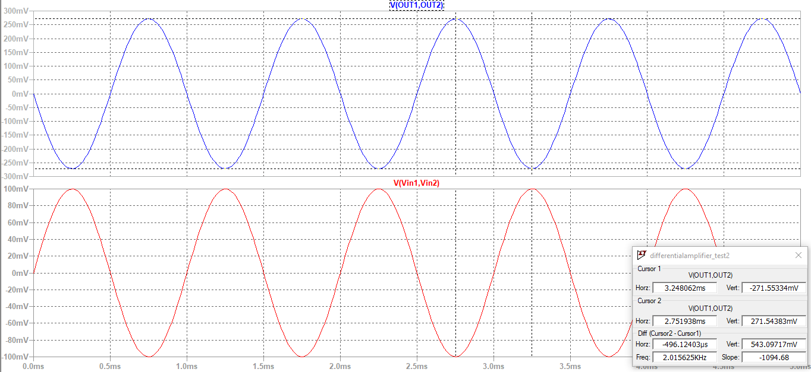

__CASE 2: vid >  &radic;2 VOV__  
let vidp-p = 800mV

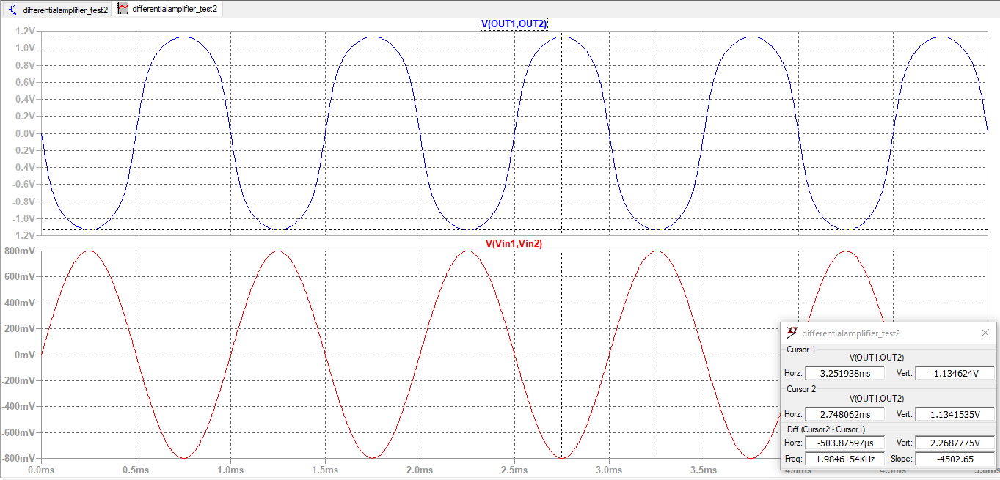

For -&radic;2 VOV < vid <  &radic;2 VOV, the differential amplifier operates linearly with undistorted output. Beyond this range, nonlinear behavior occurs (CASE 2), causing waveform distortion.

- __AC ANALYSIS:__

Transconductance, gm = (2*ID1)/VOV = 2.45 mS  
r01,2 = 1/(&lambda;*ID1) = 24kohm  
Similarly, r03,4 = 1/(&lambda;*ID1) = 24kohm  

Gain = gm1,2 * (r01,2||r03,4)  
     = 2.45m * 12k  
     = 29.4 V/V  
     = 29.36dB  
Therefore the theoretical gain is 29.36dB

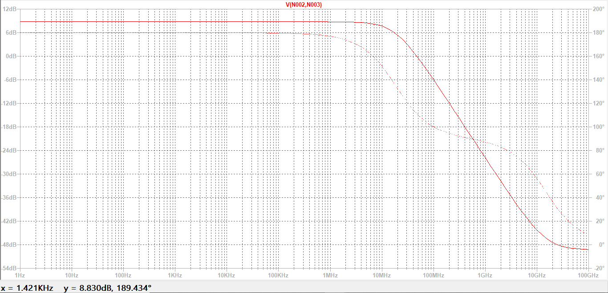

The simulated gain is 2.763dB  
Frequency at -3dB gain = 18.116MHz  
Gain Bandwidth product = 24.9MHz  

__RESULTS:__  
- The PMOS active-load differential amplifier was successfully designed and biased at the required operating point.
- Both NMOS input transistors and PMOS active load transistors operate in saturation region.
-  Linear amplification was observed for input range -&radic;2 VOV < vid <  &radic;2 VOV, while distortion occurred beyond this range.
- The two output signals are equal in magnitude and opposite in phase, validating proper differential amplification.
- The simulated gain differs significantly from theoretical gain due to non-ideal transistor effects included in simulation models.
- Despite the deviation, the amplifier shows proper differential amplification and expected active-load behavior.

__INFERENCE:__  
The simulation confirms that the amplifier operates in the linear region within the calculated swing limits, and the observed output behavior matches theoretical expectations for a differential amplifier with active load.

 ---

 __CIRCUIT - 3:__

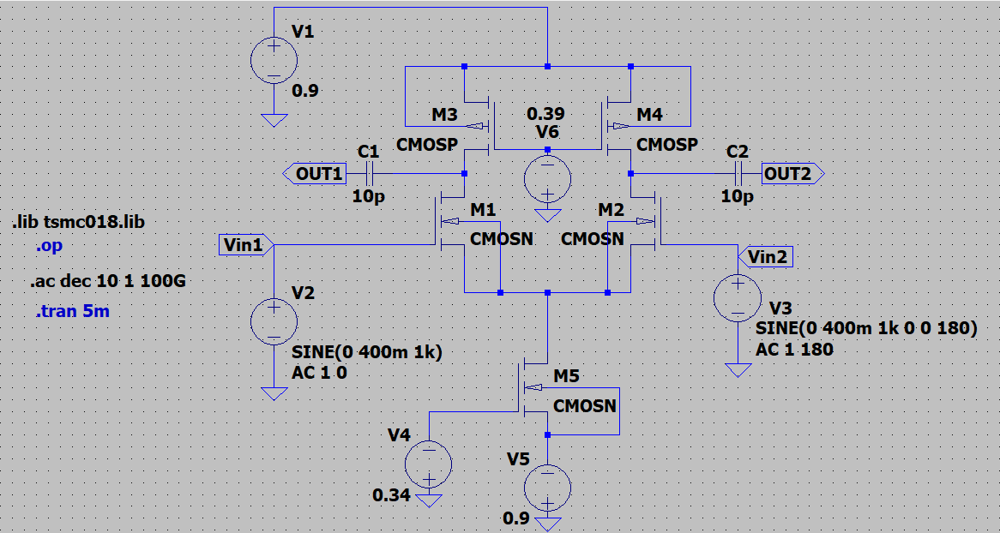

- __DC ANALYSIS:__

Power, P = 1.5mW  
P = VDD * ID  
1.5m = 1.8 * ID  
__ID = ISS = 0.833mA__

Since the 2 branches are identical, current through M1 & M3, __ID1__ = current through M2 & M4, __ID2__ = __ISS/2 = 0.4165mA__

For PMOS M3 and M4,  
VS3 = 0.9V  
VD3 = 0V  
For M3 and M4 to be in Saturation,  
VSD3 >= VSG3 - |VT|  
VSG3 <= VSD3 + |VT|  
(0.9) - VG3 = (0.9 - 0) + 0.39  
VG3 = -0.39V  

Width of M3 and M4 is given by current equation ,  
  
Substituting the values of ID1, L, VOV and kp' we get, __W = 3.7996&mu;m__

For NMOS M1 and M2,  
VG1 = VG2 = Vincm = 0V  
VGS1 = VG1 - VS1 = 0 - (-0.7) = 0.7V  
VOV1 = VGS1 - VT = 0.7 - 0.36 = 0.34V  
VDS1 = VD1 - VS1 = 0 - (-0.7) = 0.7V  

Since, VGS1 >= VT  --> 0.7V > 0.36V  
and, VDS1 >= VGS1 - VT --> 0.7V >= 0.34V  
Both __M1 and M2 are in SATURATION__

Width of M1 and M2 is given by current equation ,  
  
Substituting the values of ID1, L, VOV and kn' we get, __W = 11.259&mu;m__  

For NMOS M5,  
VD5 = VS1 = -0.7V  
VDS5 = VD5 - VS5 = (-0.7) - (-0.9) = 0.2V  

For M5 to be in Saturation,  
VDS5 >= VGS5 - VT  
VGS5 <= VDS5 + VT  
VG5 - (-0.9) = 0.2 + 0.36  
VG5 = -0.34V  

Width of M5 is given by current equation ,  
  
Substituting the values of ID, L, VOV and kn' we get, __W = 65.078&mu;m__ 

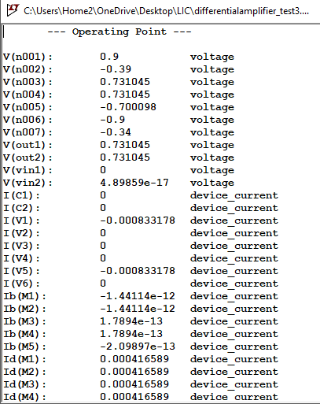  

Therefore, the DC operating point is set.

- __TRANSIENT ANALYSIS:__

Input swing,  
Vincmmin = VGS1 + VS1 = 0.7 - 0.7 = 0V  
Vincmmax = Vout + VT = 0 + 0.36 = 0.36V  

Output swing,  
Voutcmmin = VS1 + VOV1 = -0.7 + 0.34 = -0.36V   
Voutcmmax = VDD - VOV3 = 0.9 - 0.9 = 0V  

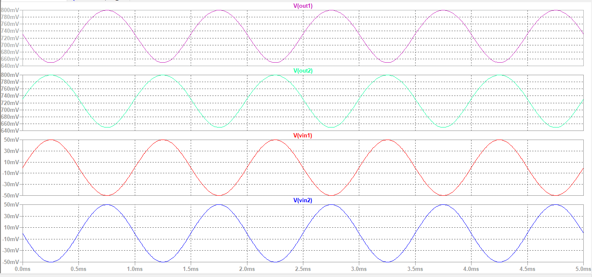

From the mathematical analysis, the maximum output voltage is obtained as 0V . This implies that for Vout > 0 , the PMOS load transistor would leave saturation and enter the triode region, violating the required operating condition for active load behavior. However, simulation shows the output exceeding 0V, indicating that the PMOS is no longer strictly in saturation in that region. Thus, while the calculated limit ensures proper saturation operation, exceeding it may lead to reduced gain and deviation from ideal differential amplifier performance.  

The differential input voltage of the amplifier varies within the range:  
__-&radic;2 VOV < vid <  &radic;2 VOV__   
-&radic;2 * 0.34 < vid <  &radic;2 * 0.34  
-0.48V < vid <  0.48V  

__CASE 1: vid <  &radic;2 VOV__  
let vidp-p = 100mV

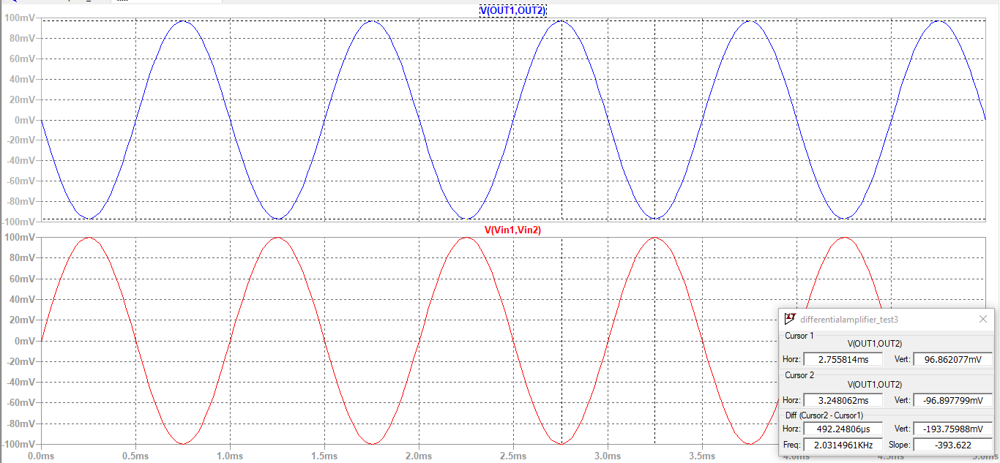

__CASE 2: vid >  &radic;2 VOV__  
let vidp-p = 800mV

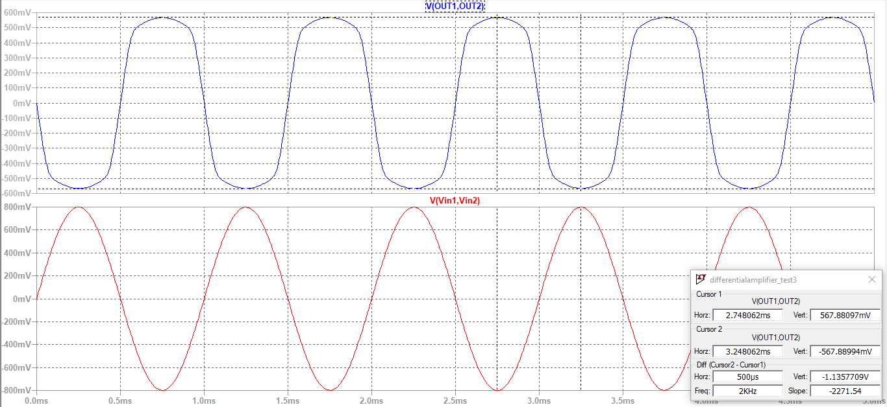

For -&radic;2 VOV < vid <  &radic;2 VOV, the differential amplifier operates linearly with undistorted output. Beyond this range, nonlinear behavior occurs (CASE 2), causing waveform distortion.

- __AC ANALYSIS:__

Transconductance, gm = (2*ID1)/VOV = 2.45 mS  
r01,2 = 1/(&lambda;*ID1) = 24kohm  
Similarly, r03,4 = 1/(&lambda;*ID1) = 24kohm  

Gain = gm1,2 * (r01,2||r03,4)  
     = 2.45m * 12k  
     = 29.4 V/V  
     = 29.36dB  
Therefore the theoretical gain is 29.36dB

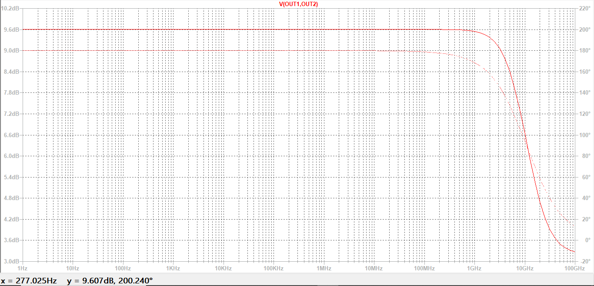

The simulated gain is 9.607dB  
Frequency at -3dB gain = 10.054GHz    
Gain Bandwidth product = 30.3GHz  

The theoretical gain is calculated as ~29.4 V/V (≈29.36 dB). However, the simulated gain is significantly lower due to non-ideal effects such as channel length modulation, large overdrive voltage of PMOS load, and reduced output resistance.  

__RESULTS:__

- The PMOS active-load differential amplifier was successfully designed and biased at the required operating point.
- Both NMOS input transistors and PMOS active load transistors operate in saturation region.
-  Linear amplification was observed for input range -&radic;2 VOV < vid <  &radic;2 VOV, while distortion occurred beyond this range.
- The two output signals are equal in magnitude and opposite in phase, validating proper differential amplification.
- The simulated gain differs significantly from theoretical gain due to non-ideal transistor effects included in simulation models.
- Despite the deviation, the amplifier shows proper differential amplification and expected active-load behavior.

__INFERENCE:__
  
The differential amplifier with PMOS active load demonstrates improved gain compared to simple resistive configurations due to higher effective output resistance. The close agreement between theoretical and simulated gain indicates proper biasing and operation of both NMOS and PMOS transistors in saturation. Compared to the earlier active-load case, this configuration shows better performance and stability, suggesting improved design conditions. Overall, the circuit validates efficient differential amplification using active load with acceptable accuracy.  

---

__COMPARISION TABLE:__

| Parameter | Circuit 1 (Resistive Load) | Circuit 2 (Active Load) | Circuit 3 (Active Load) |
|----------|----------------------------|--------------------------|--------------------------|
| Load Type | Resistor RD | PMOS Active Load | PMOS Active Load |
| Gain Expression | Av = gmRD | Av = gm(ron \|\| rop) | Av = gm(ron \|\| rop) |
| Theoretical Gain | ~14.47 dB | ~29.36 dB | ~29.36 dB |
| Simulated Gain | ~16.15 dB | ~2.763 dB | ~9.6 dB |
| Gain Accuracy | Good match | Large deviation | Moderate deviation |
| Bandwidth | 5.57 GHz | 18.116 MHz | 10.054 GHz |
| GBP | ~35.7 GHz | ~24.8 MHz | ~30.3 GHz |
| Output Type | Differential | Single-ended | Single-ended |
| Linearity | Good | Reduced | Moderate |
| Output Swing | Large | Limited | Limited |

The resistive-load differential amplifier (Circuit 1) exhibits stable and predictable performance with good agreement between theoretical and simulated gain, along with high bandwidth and linear operation. While active loads theoretically enhance gain, their practical performance is highly dependent on device parameters and operating conditions, as observed from the variation across the circuits.
