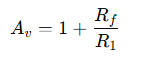

# Non-Inverting Amplifier

A **non-inverting amplifier** is a fundamental op-amp configuration where the input signal is applied to the **non-inverting (+) terminal**, and the inverting (–) terminal is connected to a feedback network consisting of resistors.

In this configuration, the output signal is **in phase** with the input signal. This makes it useful in applications where signal polarity must be preserved.

The circuit uses **negative feedback**, which stabilizes the gain and improves linearity. Due to the very high input impedance of the op-amp, the input current is approximately zero. Also, because of the concept of a **virtual short**, the voltage at the inverting and non-inverting terminals is nearly equal.  

It is widely used in buffering, signal conditioning, and amplification stages in analog circuits.  

  

  
The Gain of the amplifier is, 
 ​

 
where, Rf is the feedback resistor 

---

