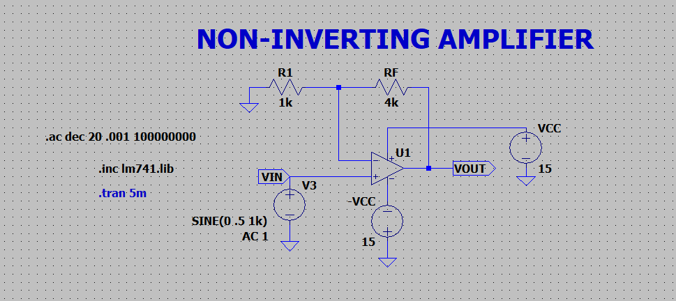
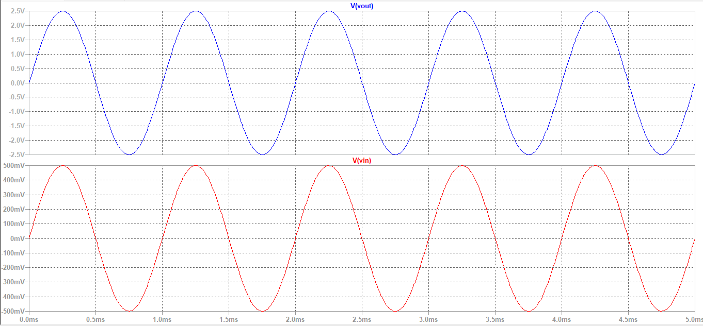
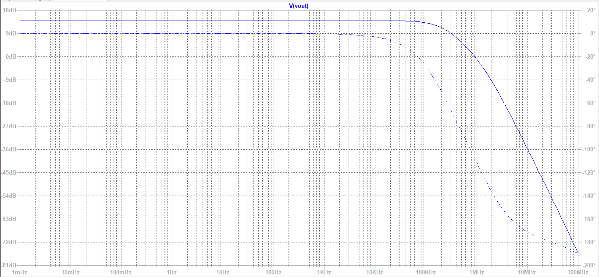
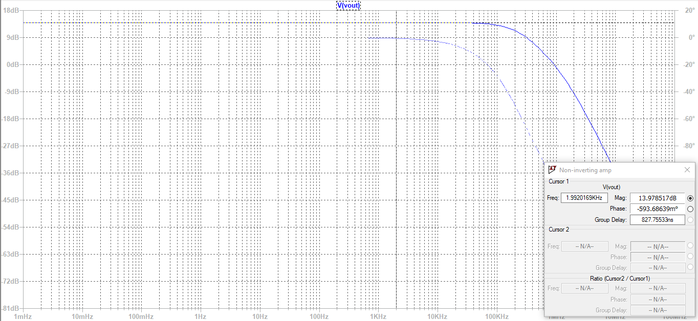

# Non-Inverting Amplifier

A **non-inverting amplifier** is a fundamental op-amp configuration where the input signal is applied to the **non-inverting (+) terminal**, and the inverting (–) terminal is connected to a feedback network consisting of resistors.

In this configuration, the output signal is **in phase** with the input signal. This makes it useful in applications where signal polarity must be preserved.

The circuit uses **negative feedback**, which stabilizes the gain and improves linearity. Due to the very high input impedance of the op-amp, the input current is approximately zero. Also, because of the concept of a **virtual short**, the voltage at the inverting and non-inverting terminals is nearly equal.  

It is widely used in buffering, signal conditioning, and amplification stages in analog circuits.  

  

  
The Gain of the amplifier is, 
 ​

 
where, Rf is the feedback resistor 

---

**Design OPAMP based circuit and analyze the frequency response**

Given:  
Vcc = 15 V  
-Vcc = -15 V   
Av = +5 V/V  

**Design:**  
Av = +5 V/V  

  

5 = 1 + (Rf/R1)  
(Rf/R1) = 4  
**Rf = 4R1**

Choosing R1 = 1K&ohm;  
Therefore, Rf = 4K&ohm;

**Circuit:**  

  
  
**Input and Output Waveforms:**

  

It can be seen that Vinp-p = 1V and Voutp-p = 5V

Gain = Vout/Vin = 5V/1V = 5 V/V  

- The output waveform is observed to be in phase with the input waveform, confirming the non-inverting nature of the amplifier.
- From the graph, the output amplitude is approximately 5 times the input amplitude, indicating a gain of about 5 V/V.
- The gain obtained from the waveform matches closely with the theoretical value.
- There is no distortion in the waveform, showing that the op-amp is operating within its linear region.
- The shape of the waveform is preserved, indicating faithful amplification of the input signal.
 
**Frequency Response**

    
    

Simulated gain = 13.97 dB = 4.99 V/V  
Frequency at -3dB gain = 215.358KHz  
GBP = 1074.636KHz

- The midband gain is observed to be approximately, 20log(5)≈14 dB which matches the expected gain of 5 V/V.
- The gain remains constant (~14 dB) over a range of low frequencies, indicating stable amplifier performance in the midband region.
- The product of gain and bandwidth remains approximately constant, validating the gain-bandwidth product (GBP) characteristic of the op-amp.

**Inference:**

- The experiment verifies that a non-inverting amplifier provides **amplified output without phase inversion**.
- The practical gain obtained from simulation closely matches the theoretical value, confirming correct design and component selection.
- The frequency response demonstrates the **gain-bandwidth trade-off**, where higher gain results in reduced bandwidth.
- The absence of distortion indicates proper biasing and operation of the op-amp within its limits.
- Overall, the non-inverting amplifier proves to be a **stable and reliable configuration** for signal amplification with high input impedance and predictable gain.
