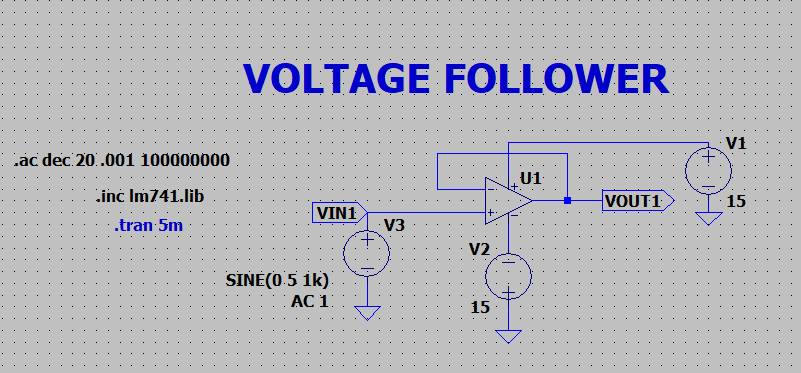
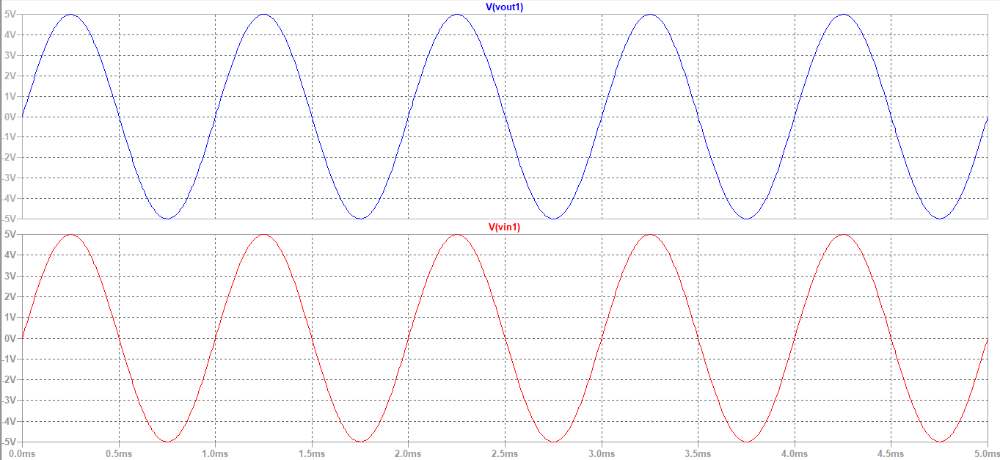
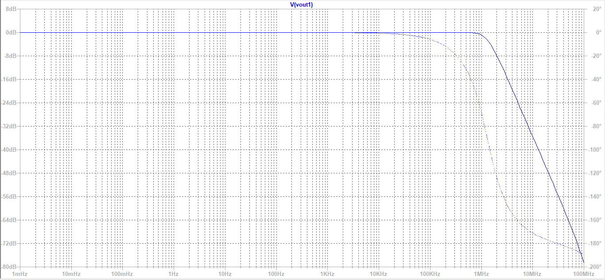

# Voltage Follower

A **voltage follower**, also known as a **unity gain buffer**, is a special configuration of an operational amplifier where the output is directly fed back to the inverting (–) terminal, and the input signal is applied to the non-inverting (+) terminal.

In this configuration, the amplifier provides **no voltage gain**, and the output voltage follows the input voltage exactly. Hence, it is called a voltage follower.

The circuit employs **100% negative feedback**, which forces the op-amp to operate in a stable linear region.

  

 Output Voltage Equation: **Vout = Vin**
 
---

 **Design OPAMP based circuit and analyze the frequency response**

Vcc = 15 V  
-Vcc = -15 V   
RL = 2.2K&ohm;  

**Circuit:**

  
 

**Input and Output Waveforms:**

  
 

Here, Vinp-p = 5V
and Voutp-p = 5V

**Frequency Response:**

  

Simulated gain = 0dB  
Hence, GBP = 0Hz
