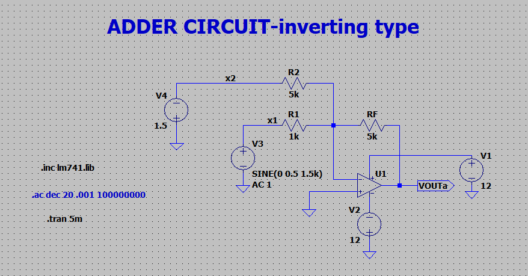
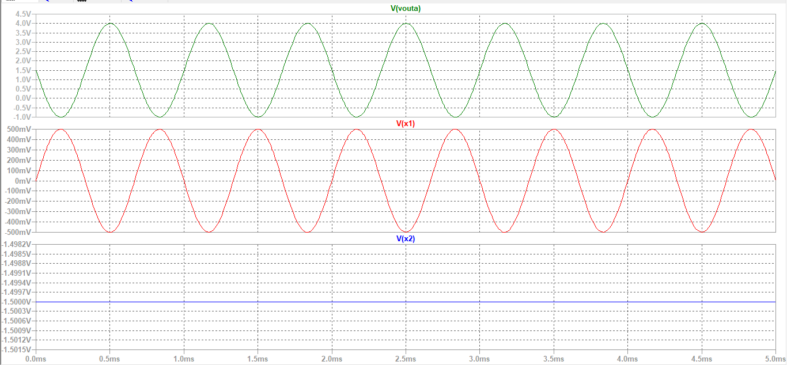
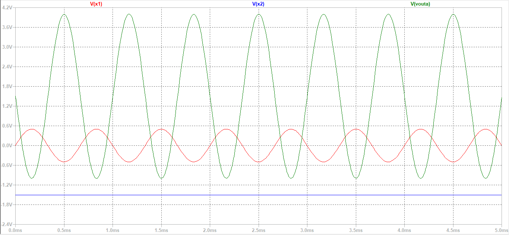
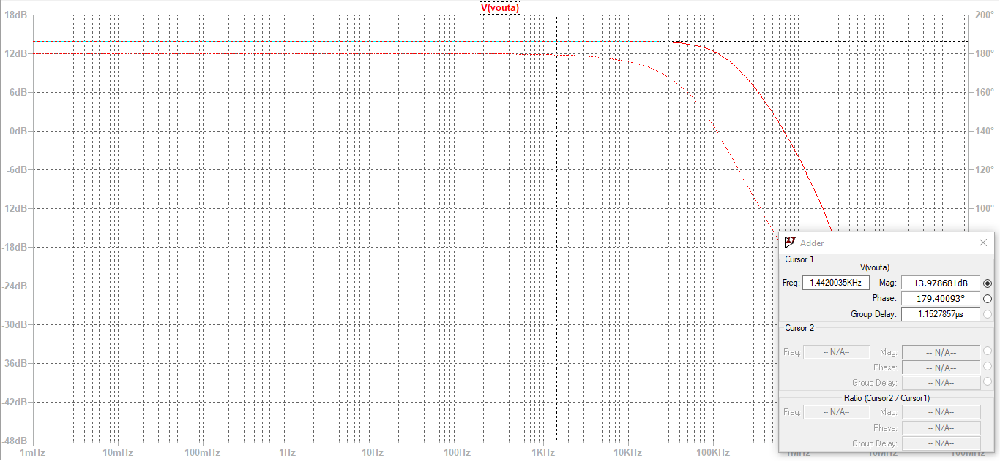

# Inverting Summing Amplifier

An **inverting summing amplifier** is an op-amp configuration used to **add multiple input voltages** and produce a single output that is proportional to their **weighted sum with inversion**.

In this circuit, all input signals are applied to the **inverting (–) terminal** through individual resistors, while the non-inverting (+) terminal is connected to ground. The circuit operates using negative feedback, ensuring accurate and stable summation.

The output voltage is an inverted combination of all input voltages.

  
The Gain of the amplifier is, 
 ​

 
where, Rf is the feedback resistor

and V1,V2....Vn are input voltages.

---

**Design the circuit using OPAMP to get the output as given:**

**y1(t) = -[5x1(t) + x2(t)]**

Given:  
x1(t) = 0.5 sin(3000&pi;t) V  
x2(t) = -1.5V  
Vcc = 12 V  
-Vcc = -12 V   

**Design:**

y1(t) = -[5x1(t) + x2(t)] is of the form   

Here,  

According to the question,  
For V1,  
(-Rf/R1) = -5  
Rf = 5*R1

Assuming **R1 = 1K&ohm;,**    
**Rf = 5*1K&ohm; = 5K&ohm;**

Similarly,
For V2,  
(-Rf/R2) = -1  
Rf = R2

Since Rf = 5K&ohm;,  
**R2 = 5K&ohm;**  
  
**Circuit:**

  
**Input and Output Waveforms:**

  

**AC Analysis:**

