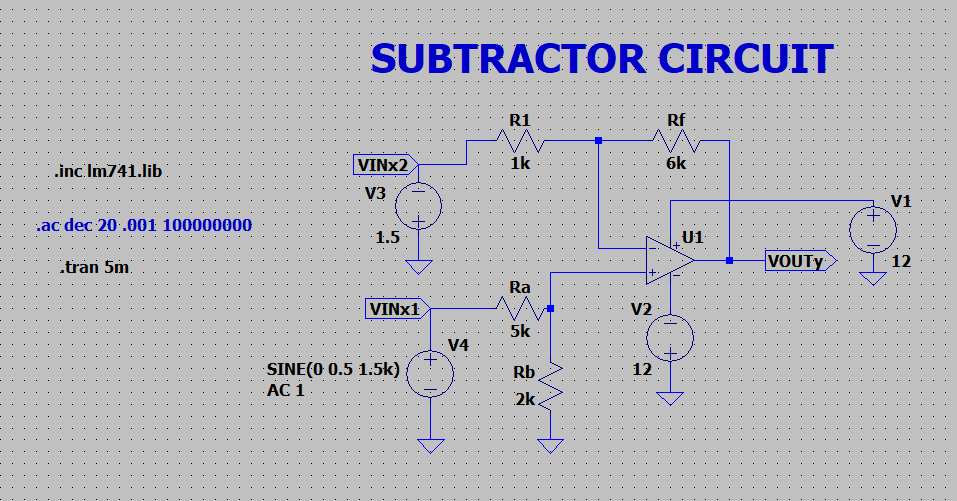
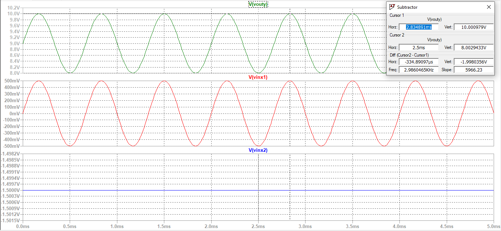
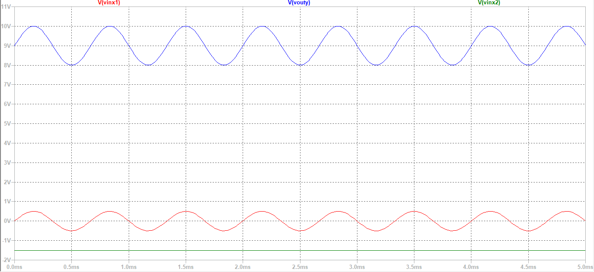
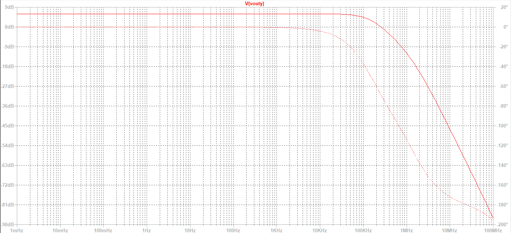

# Subtractor

A **subtractor**, also known as a **difference amplifier**, is an operational amplifier configuration used to obtain the **difference between two input voltages**. It produces an output proportional to the difference of the applied signals.

In this circuit, one input is applied to the **inverting (–) terminal** and the other to the **non-inverting (+) terminal** through appropriate resistor networks. The circuit uses **negative feedback**, ensuring stable and linear operation.

The subtractor is widely used in applications where it is required to **eliminate common signals (noise)** and extract the difference between two signals.

  
The Gain of the amplifier is, 
 ​

where,

 

---

**Design the circuit using OPAMP to get the output as given:**

**y3(t) = 2x1(t) - 6x2(t)**

Given:  
x1(t) = 0.5 sin(3000&pi;t) V  
x2(t) = -1.5V  
Vcc = 12 V  
-Vcc = -12 V   

**Design:**

y3(t) = 2x1(t) - 6x2(t)] is of the form   

According to the question,  
For V2,  
(-Rf/R2) = -6  
Rf = 6R2

Assuming **R1 = 1K&ohm;,**    
**Rf = 6*1K&ohm; = 6K&ohm;**  

For V1,  
(1+(Rf/R1))(Rb/(Ra+Rb)) = 2  
(1+(6K/1K))(Rb/(Ra+Rb)) = 2  
7(Rb/(Ra+Rb)) = 2  
Rb/(Ra+Rb) = 2/7  
7Rb = 2Ra + 2Rb  
Rb/Ra = 2/5 = 0.4  

Hence, let **Ra = 5K&ohm;  
then Rb = 2K&ohm;**    
  
**Circuit:**

  
**Input and Output Waveforms:**

  

- The output waveform represents the **difference between the two input signals**, confirming correct subtractor operation.
- When both inputs are sinusoidal, the output waveform clearly shows a resultant waveform corresponding to V2−V1.
- The output polarity depends on the relative magnitudes of the inputs:
- If V2>V1, output is positive  
  If V1>V2, output is negative  
  This matches the behavior of a difference amplifier  
- The waveform may appear inverted with respect to one input, since the circuit combines both inverting and non-inverting actions.
- The output amplitude reflects the scaled difference (gain × difference) rather than individual input amplitudes.
- The clean waveform without distortion indicates that the circuit is operating in the linear region with proper resistor matching.

**AC Analysis:**

Simulated gain = 6.0199 dB = 1.9999 V/V  
Bandwidth = 149.65441KHz  
GBP = 299.2938KHz  

- The AC analysis shows a midband gain of approximately **6.0199 dB**, which corresponds to **1.9999 V/V**.
- The gain remains constant in the low-frequency region, confirming stable operation and accurate difference amplification.
- The −3 dB cutoff frequency is observed at approximately **149.65441KHz**, which defines the effective bandwidth of the subtractor circuit.
- The slight variation between theoretical and simulated values is due to non-ideal op-amp characteristics and possible resistor mismatch, which also affects common-mode rejection.

**Inference:**

- The experiment demonstrates that the op-amp subtractor can effectively extract the difference between two input signals while suppressing common components.
- The obtained gain (~2 V/V) indicates that the circuit not only performs subtraction but also scales the difference signal, showing controlled differential amplification through resistor selection.
- The behavior of the circuit confirms that its performance is strongly dependent on resistor ratio matching, which determines both accuracy and common-mode rejection capability.
- The finite bandwidth observed in AC analysis highlights the practical limitations of the op-amp, emphasizing that accurate subtraction is restricted to a specific frequency range.
- Overall, the subtractor is validated as an important building block in signal conditioning and noise reduction applications, where extracting small differences between signals is required.
